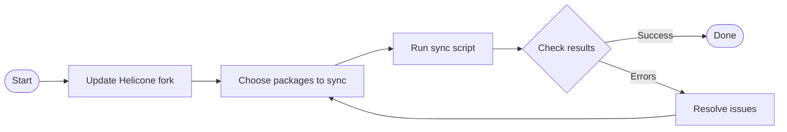

# Syncing Helicone Packages to AI Cost Calculator

## Quick Start

To sync packages from Helicone to the AI Cost Calculator repository:

```bash
# 1. Update your Helicone fork first
git fetch upstream
git merge upstream/main
git push origin main

# 2. Then run the sync script (default packages: cost and llm-mapper)
./sync_with_helicone.sh
```

## What This Script Does

This script safely copies the `cost` and `llm-mapper` packages from Helicone to the AI Cost Calculator repository, removing any potential secrets or API keys in the process.

## Running the Sync

### Prerequisites

- Git command line tools
- SSH access to both repositories
- Bash shell environment
- **Important**: Your Helicone fork must be up-to-date with the latest upstream changes

### Step 1: Update Your Helicone Fork

Before running the sync script, make sure your Helicone fork is up to date:

```bash
# Ensure you're in your Helicone directory
cd /path/to/helicone

# Add upstream if not already added
git remote add upstream https://github.com/helicone/helicone.git

# Fetch and merge latest changes
git fetch upstream
git merge upstream/main

# Push changes to your fork
git push origin main
```

### Step 2: Run the Sync Script

#### Basic Usage

Run the script without any parameters to sync the default packages:

```bash
./sync_with_helicone.sh
```

#### Syncing Specific Packages

You can specify which packages to sync using the `PACKAGES_TO_SYNC` environment variable:

```bash
# Sync only the cost package
PACKAGES_TO_SYNC="cost" ./sync_with_helicone.sh

# Sync multiple specific packages
PACKAGES_TO_SYNC="cost llm-mapper" ./sync_with_helicone.sh

# Sync a different package
PACKAGES_TO_SYNC="some-other-package" ./sync_with_helicone.sh
```

### Workflow Diagram



## Troubleshooting

If you encounter errors during the sync:

1. Check that your Helicone fork is up to date with the latest changes
2. Ensure you have SSH access to both repositories
3. Check that the target branch (main) exists in the target repository
4. Look for merge conflicts if the push fails

## Security Notes

The script includes security measures to protect sensitive information:
- Automatically removes `.env` files
- Sanitizes configuration files
- Removes potential API keys from all files
