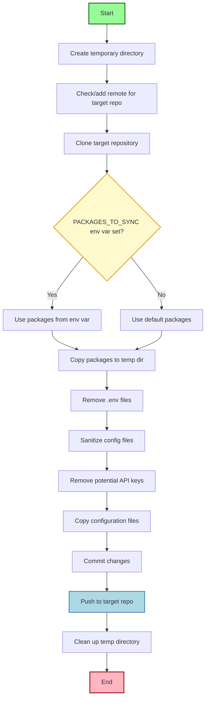

# Helicone to AI Cost Calculator Sync

This document describes how to use the `sync_with_helicone.sh` script to safely synchronize packages from the Helicone repository to the AI Cost Calculator repository.

## Overview

The sync script is designed to:

1. Copy specified packages from Helicone to the AI Cost Calculator repository
2. Remove any potential secrets or sensitive information during the sync
3. Commit and push changes to the target repository

## Process Flow



## Prerequisites

- Git command line tools
- SSH access to both repositories
- Bash shell environment

## Basic Usage

To sync the default packages (`cost` and `llm-mapper`):

```bash
./sync_with_helicone.sh
```

## Advanced Usage

### Syncing Specific Packages

You can specify which packages to sync using the `PACKAGES_TO_SYNC` environment variable:

```bash
# Sync only the cost package
PACKAGES_TO_SYNC="cost" ./sync_with_helicone.sh

# Sync multiple specific packages
PACKAGES_TO_SYNC="cost llm-mapper" ./sync_with_helicone.sh

# Sync a different package
PACKAGES_TO_SYNC="some-other-package" ./sync_with_helicone.sh
```

## What Gets Synced

When you run the script, it:

1. Creates a temporary directory for the sync process
2. Clones the target repository into this temporary directory
3. Copies the specified packages to the target repository
4. Copies configuration files (package.json, tsconfig.json, etc.)
5. Sanitizes the copied files to remove potential API keys or secrets
6. Commits and pushes the changes to the target repository
7. Cleans up the temporary directory

## Security

The script includes measures to prevent exposing sensitive information:

- Removes `.env` files
- Sanitizes configuration files to remove API keys
- Removes potential secret patterns from all files

## Troubleshooting

If you encounter errors:

- Check that you have SSH access to both repositories
- Ensure the target branch (main) exists in the target repository
- Check for merge conflicts if the push fails

## Notes

- The script uses a temporary directory approach to ensure clean syncing without pushing the entire codebase
- Only specific packages and configuration files are synced, not the entire repository
