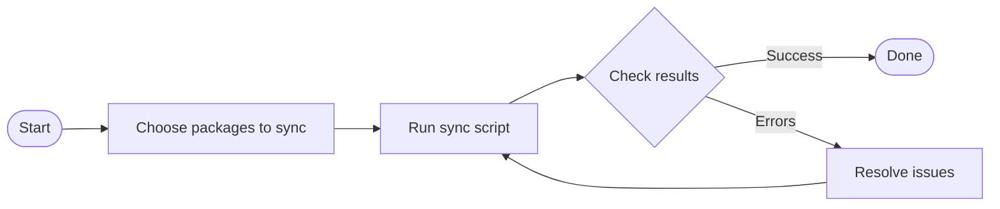

# Syncing Helicone Packages to AI Cost Calculator

## Quick Start

To sync packages from Helicone to the AI Cost Calculator repository:

```bash
# Standard sync (default packages: cost and llm-mapper)
./sync_with_helicone.sh
```

## What This Script Does

This script safely copies the `cost` and `llm-mapper` packages from Helicone to the AI Cost Calculator repository, removing any potential secrets or API keys in the process.

## Running the Sync

### Prerequisites

- Git command line tools
- SSH access to both repositories
- Bash shell environment

### Basic Usage

Run the script without any parameters to sync the default packages:

```bash
./sync_with_helicone.sh
```

### Syncing Specific Packages

You can specify which packages to sync using the `PACKAGES_TO_SYNC` environment variable:

```bash
# Sync only the cost package
PACKAGES_TO_SYNC="cost" ./sync_with_helicone.sh

# Sync multiple specific packages
PACKAGES_TO_SYNC="cost llm-mapper" ./sync_with_helicone.sh

# Sync a different package
PACKAGES_TO_SYNC="some-other-package" ./sync_with_helicone.sh
```

### Workflow Diagram



## Troubleshooting

If you encounter errors during the sync:

1. Check that you have SSH access to both repositories
2. Ensure the target branch (main) exists in the target repository
3. Look for merge conflicts if the push fails

## Security Notes

The script includes security measures to protect sensitive information:
- Automatically removes `.env` files
- Sanitizes configuration files
- Removes potential API keys from all files
